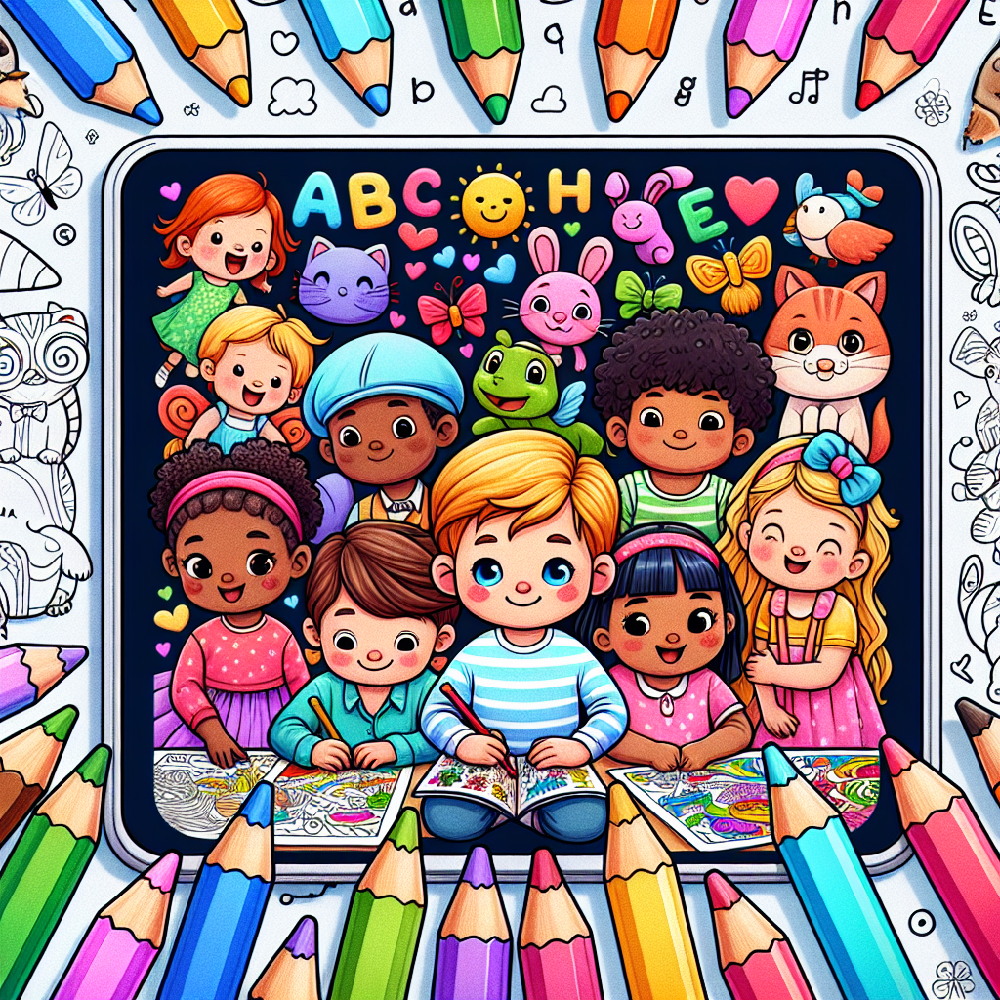
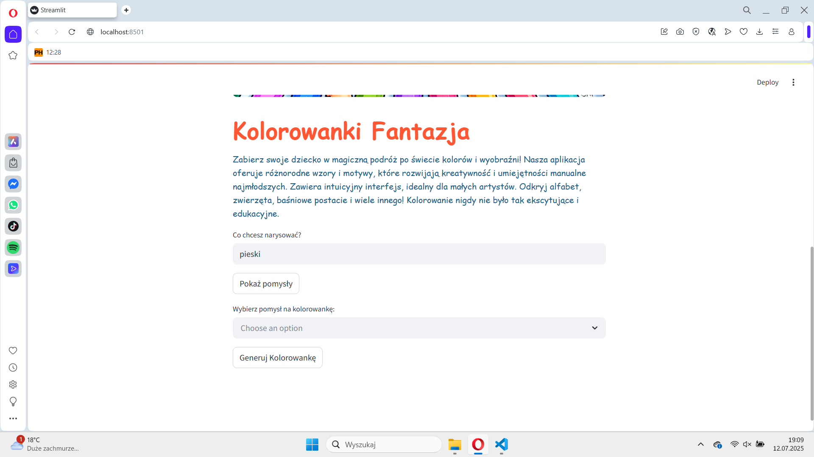
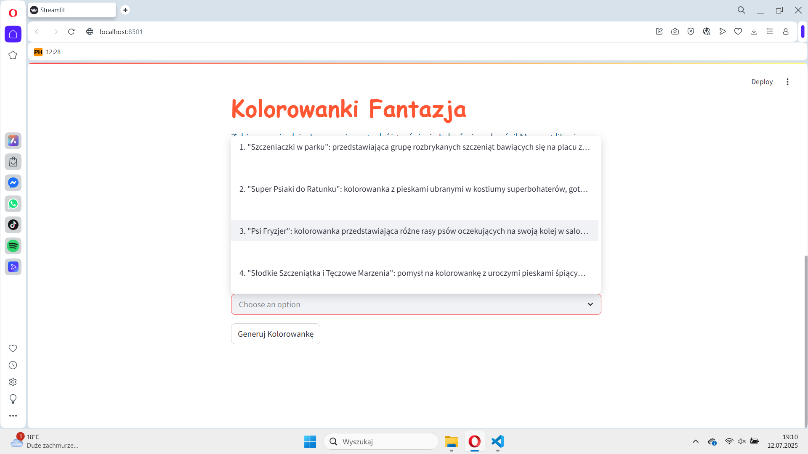
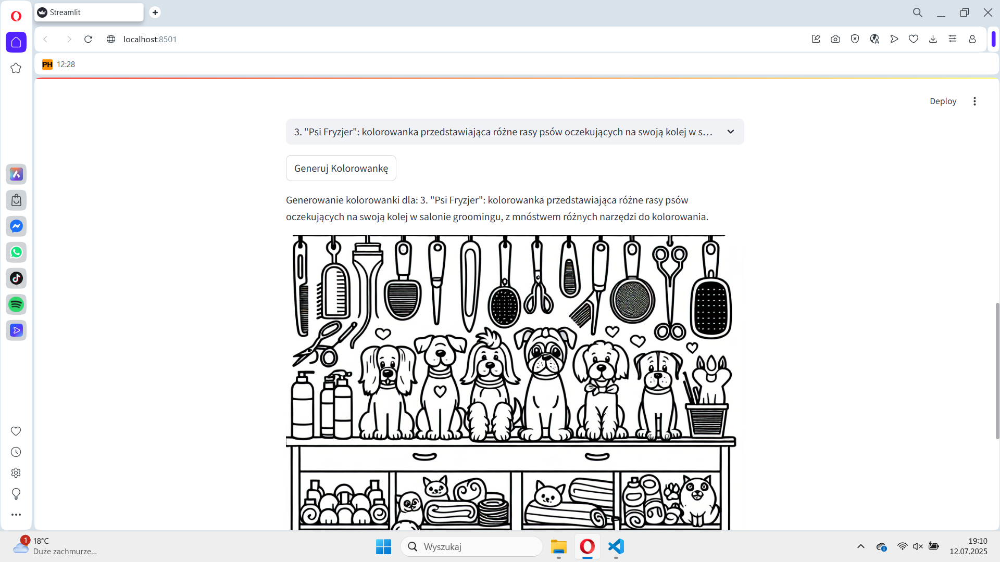
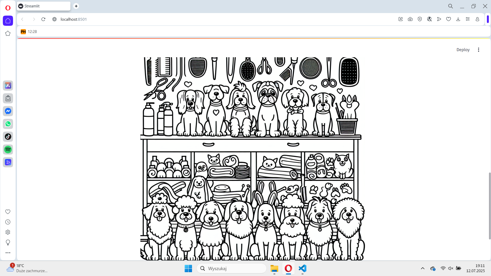

# Kolorowanka_Fantazja

Zapraszam do odkrycia aplikacji „Kolorowanka”! Dzięki niej malowanie stanie się jeszcze przyjemniejsze i bardziej kreatywne. Wystarczy, że wpiszesz w polu tekstowym to, co chcesz namalować, a nasza zaawansowana sztuczna inteligencja zaproponuje Ci kilka unikalnych propozycji. To idealny sposób na rozwijanie swojej wyobraźni i tworzenie wyjątkowych dzieł sztuki. Dołącz do naszej twórczej społeczności i zacznij swoją artystyczną przygodę z „Kolorowanką”!

**Technologie i Narzędzia Wykorzystane**:

- **Streamlit**: Używane do budowy interfejsu użytkownika i tworzenia interaktywnych aplikacji webowych.
- **OpenAI**: Wykorzystujemy zaawansowane modele sztucznej inteligencji do generowania różnorodnych propozycji artystycznych na podstawie wprowadzonego tekstu.
- **python-dotenv**: Umożliwia bezpieczną obsługę poufnych informacji, takich jak klucze API, poprzez ładowanie zmiennych środowiskowych z plików `.env`.

*przykładowe zdjęcia:*

[Idź do Repozytorium ](https://github.com/Rafal-codeBenderz/Kolorowanka.git)