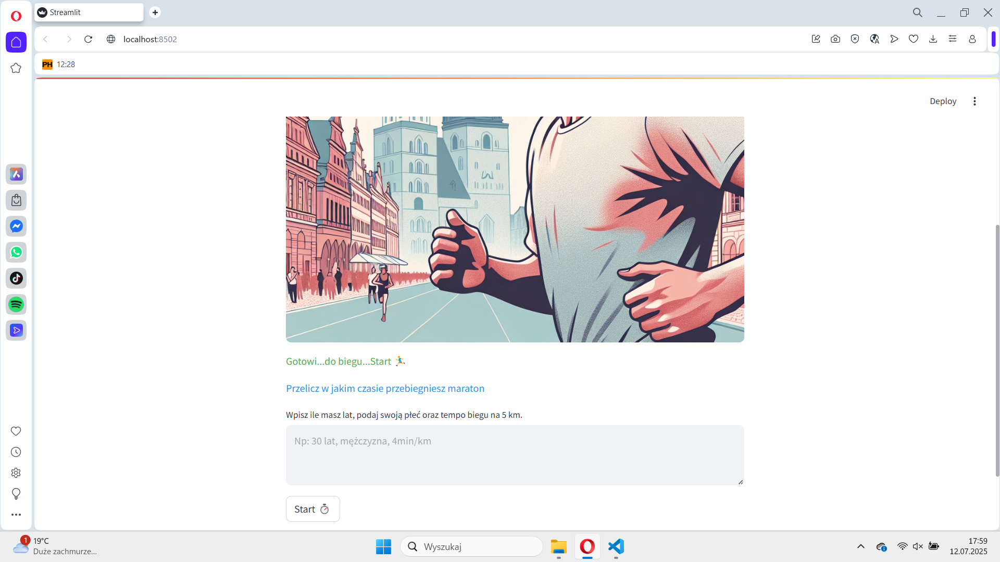
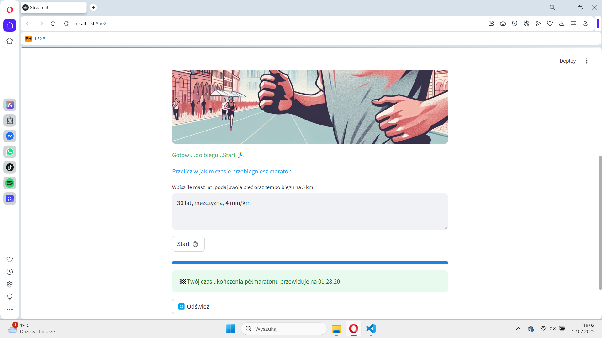

# Półmaraton2

Aplikacja internetowa, zaprojektowana dla pasjonatów biegania, umożliwia przewidywanie wyników półmaratońskich na podstawie danych użytkownika, takich jak płeć, wiek, czas i tempo biegu na 5 km.

Główna funkcjonalność aplikacji opiera się na modelu regresji, który został zbudowany przy użyciu biblioteki PyCaret. Model ten został wytrenowany na danych z wrocławskich półmaratonów z lat 2023-2024. Po dokładnym oczyszczeniu i analizie danych dzięki eksploracyjnej analizie, stworzono skuteczny i niezawodny model predykcyjny.

**Technologie i Narzędzia Wykorzystane**:

- **Streamlit** – framework do tworzenia interaktywnych aplikacji webowych w Pythonie,
- **Git** – system kontroli wersji i wdrażania,
- **PyCaret** – biblioteka uczenia maszynowego stosowana do modelowania regresji,
- **Conda** – zarządzanie środowiskiem i zależnościami,
- **Visual Studio Code** – środowisko programistyczne,
- **OpenAI GPT-4o** – model językowy do generowania spersonalizowanych rekomendacji treningowych,
- **Langfuse** – monitorowanie zachowania AI i analiza zapytań,
- **Python** – język programowania używany w projekcie,
- **Matplotlib, Seaborn** – wizualizacja danych i porównania wyników,
- **Pandas, NumPy** – przetwarzanie danych i analiza numeryczna,
- **AWS (boto3)** – integracja z usługami chmurowymi,
- **DigitalOcean App Platform** – środowisko hostingowe do wdrażania aplikacji,
- **dotenv** – konfiguracja środowiska i zarządzanie kluczami API.

*przykładowe zdjęcia:*

[Idź do Repozytorium ](https://github.com/Rafal-codeBenderz/Maraton.git)